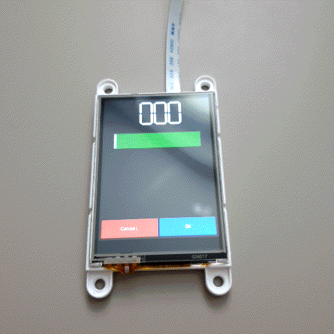

# GFX4dGrid

## About

This library works on top of GFX4dPrimitiveWidgets. The screen is split into a grid. The widgets are added onto a grid(x,y) in combination with grid(width,height). This makes it easier to place elements on the screen while also making touch interaction more efficient. Elements of type PrimitiveInput receive a callback, while elements of type PrimitiveOutput can be updated via a call to gridObject->updateOutput()

## How to use

Clone this repository into your Arduino/libraries directory

## Example

See file in examples dir